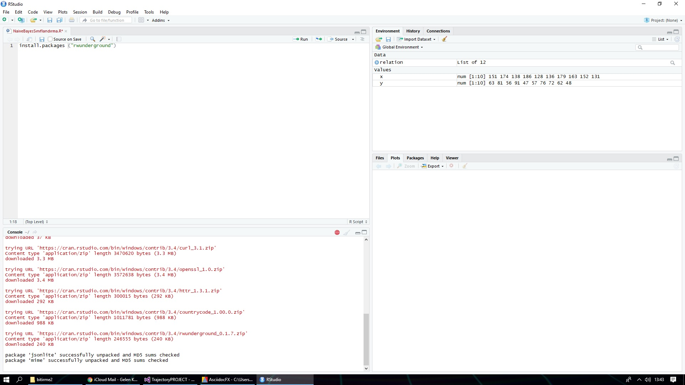

*CRAN ile Türkiye/Kocaeli Bölgesi İçin 10 Günlük Hava Tahmini* +

<<<<<<< HEAD
İlk adım devtools paketini kurulumudur.RStudio konsol ekranına aşağıda belirtilen kod parçacığı yazılıp devtools yüklenir.
=======
İlk olarak devtools paketini kurmamız gerekmektedir.Onun için Rstudio konsoluna şunu yazıyoruz
>>>>>>> 9cdbe55fabdd3f8bea4e3713a4c61bb3c41f8f1c

----
install.packages("devtools")
----
<<<<<<< HEAD

Ardından rwunderground paketi aynı yöntemle indirilir.
=======
image::images/install.png[]

Daha sonra rwunderground paketini indirelim.
>>>>>>> 9cdbe55fabdd3f8bea4e3713a4c61bb3c41f8f1c

----
install.packages("rwunderground")

----

<<<<<<< HEAD
Hava durumu verileri [underline]#http://https://www.wunderground.com/[www.wunderground.com]# aracılığı ile alınır. 

Rwunderground ise yukarda belirtilen web sitesinin API uygulamasıdır.

Devtools kullanarak API kurulumu aşağıdaki kod parçacığının RStudio konsoluna yazılması ile tamamlanır.
=======
İlk olarak devtoolsu yüklemezseniz rwunderground yüklenmeyebilir bağlı paketler çünkü. +

Hava durumu datalarını [underline]#http://https://www.wunderground.com/[www.wunderground.com]# aracılığı ile alacağız. rwunderground ise bu siteyle alakalı R için geliştirilmiş bir api. 

Şimdi devtools ile apiyi kuralım.
>>>>>>> 9cdbe55fabdd3f8bea4e3713a4c61bb3c41f8f1c
----
devtools::install_github("ALShum/rwunderground")
----

<<<<<<< HEAD
image::images\install2.jpg[]

Bu işlemleri tamamladıktan sonra [underline]#http://https://www.wunderground.com/[www.wunderground.com]# siteden üyelik alınır.Alınan üyelik geliştirici üyeliğe terfi ettirilir ve API key elde edilir.

API key RStudio programının konsol ekranına aşağıdaki kod parçacığı ile tanıtılır.
=======
image::images\install2.png[]

Bu işlemleri tamamladıktan sonra [underline]#http://https://www.wunderground.com/[www.wunderground.com]# siteden üyelik alıp geliştirici üyeligine cevirelim ücretsiz olarak ordan api keyimizi alalım.Ve konsola yapıştıralım
>>>>>>> 9cdbe55fabdd3f8bea4e3713a4c61bb3c41f8f1c
----
rwunderground::set_api_key("KEY")
----

<<<<<<< HEAD
Hava durumu alınmak istenen lokasyonun bilgileri RStudio konsol ekranına aşağıda belirtildiği gibi eklenmelidir.
=======
Lokasyonu tanıtalım.
>>>>>>> 9cdbe55fabdd3f8bea4e3713a4c61bb3c41f8f1c

----
set_location(territory = "Turkey", city = "Izmit")
----
<<<<<<< HEAD

Son adım verilerin API'den alınmasıdır.
Bunun için aşağıda belirtilen kod parçacığı RStudio Konsol ekranına eklenir.

=======
Ve verileri çekelim ( 10 günlük ) 
>>>>>>> 9cdbe55fabdd3f8bea4e3713a4c61bb3c41f8f1c
----
forecast10day(set_location(territory = "Turkey", city = "Izmit"))
----

